<div align="center">

<!-- Futuristic Animated Header -->


<!-- Dynamic Typing Animation -->
<a href="https://git.io/typing-svg">
  
</a>

<!-- Premium Social Badges -->
<p align="center">
  <a href="https://github.com/SamirShaikh03">
    
  </a>
  <a href="https://github.com/samirshaikh744">
    
  </a>
  <a href="https://www.linkedin.com/in/samir-shaikh-9424b4380">
    
  </a>
</p>

<p align="center">
  <a href="mailto:shaikhsaim8442@gmail.com">
    
  </a>
</p>
</div>


### 👨‍💻 **About Me**

```javascript
const samir = {
    location: "Pune, India 🇮🇳",
    education: "Computer Engineering @ G.H Raisoni CoEM",
    currentFocus: ["Full Stack Development", "Web3 Technologies"],
    learning: ["React.js", "Advanced Java", "Modern UI/UX"],
    askMeAbout: ["Web Dev", "Tech", "Pizza Ordering Systems"],
    funFact: "First Rank in SSC - Because Code Runs in My Blood! 🏆",
    lifePhilosophy: "Build, Break, Learn, Repeat 🔄"
};
```

<br/>


<!-- Tech Stack with Modern Design -->
<div align="center">

## 🛠️ **Technology Arsenal**

### **💻 Programming Languages**

<p align="center">
  
</p>

### **⚛️ Frontend Development**

<p align="center">
  
</p>

### **🔧 Backend & Databases**

<p align="center">
  
</p>

### **🎨 Tools & Design**

<p align="center">
  
</p>

### **📚 Additional Skills**

<p align="center">
  
  
  
  
  
</p>

</div>


<!-- Skill Proficiency Bars -->
<div align="center">

## 📊 **Technical Proficiency Levels**

<table>
<tr><td>

```text
Language Proficiency:
━━━━━━━━━━━━━━━━━━━━━━━━━━━━━━━━━━━━━━━━

C/C++           ████████████████████  90%
HTML/CSS        ████████████████████  100%
Java            ██████████████████░░  80%
React.js        ████████████████░░░░  70%
Python          ████████████████░░░░  70%
JS              ████████████████░░░░  70%
```

</td><td>

```text
Tech Stack Mastery:
━━━━━━━━━━━━━━━━━━━━━━━━━━━━━━━━━━━━━━━━

Node.js         ███████████████░░░░░  75%
MongoDB         ████████████████░░░░  80%
SQL/MySQL       ███████████████░░░░░  75%
UI/UX Design    ████████████████████  100%
Git/GitHub      ██████████████████░░  80%
Problem Solving ██████████████░░░░░░  70%
```

</td></tr>
</table>

</div>

---


## 🎯 What I'm Currently Working On

<table>
<tr>
<td width="50%">

### 🔥 Recent Projects
- 🍕 **Pizza Ordering Web App** - Full-featured platform with menu browsing, cart management & checkout
- 💼 **Software Company Website** - Responsive multi-section corporate site with modern UI
- 🍰 **Sweet Delights Bakery** - E-commerce platform with dynamic product catalog
- 📚 Learning React.js & Advanced Java Concepts

</td>
<td width="50%">

### 🎓 Currently Learning
- ⚛️ Complete React.js Development
- ☕ Advanced Java Programming
- 🎨 Modern UI/UX Design Patterns
- 🚀 Full Stack Best Practices
- 📱 Responsive Web Design

</td>
</tr>
</table>


## 🏆 Achievements & Milestones

<div align="center">

<table>
<tr>
<td align="center" width="33%">

<h3>🥇 First Rank in SSC</h3>
<p>Secured 1st Rank in School (2020)</p>
</td>
<td align="center" width="33%">

<h3>🏅 Best Student Award</h3>
<p>Achieved Best Student Award (2020)</p>
</td>
<td align="center" width="33%">

<h3>📜 Certified Developer</h3>
<p>React.js & Java Certified</p>
</td>
</tr>
</table>

</div>


## 📊 GitHub Analytics

<div align="center">
  
  
</div>

<div align="center">
  
</div>

<div align="center">
  
</div>


## 🎨 Featured Projects

<div align="center">

<table>
<tr>
<td width="50%">

### 🍕 [Pizza Ordering Web App](https://github.com/samirshaikh744)


A modern web application for browsing, ordering, and tracking pizza orders. Features include menu browsing, cart management, and smooth checkout flow.

**Key Features:**
- 🛒 Dynamic Cart Management
- 💳 Integrated Checkout Flow
- 📱 Fully Responsive Design
- 🎨 Modern UI/UX

</td>
<td width="50%">

### 💼 [Software Company Website](https://github.com/SamirShaikh03)


Comprehensive corporate website showcasing company services, expertise, and events with modern design patterns.

**Key Features:**
- 📊 Interactive Sections
- 📧 Contact Form Integration
- 🎭 Popup & Modal System
- ⚡ Optimized Performance

</td>
</tr>
<tr>
<td width="50%">

### 🍰 [Sweet Delights Bakery](https://github.com/SamirShaikh03)


Interactive e-commerce platform for a fictional bakery with product browsing, search, and shopping cart capabilities.

**Key Features:**
- 🔍 Smart Search & Filter
- 🛍️ Shopping Cart System
- 📦 Order Tracking
- 🌟 Product Catalog

</td>
<td width="50%">

### 🎓 [Learning Projects](https://github.com/SamirShaikh03)


Collection of projects built while learning React.js, Java, and modern web development practices.

**Focus Areas:**
- ⚛️ React Component Design
- ☕ Java OOP Concepts
- 🎯 Algorithm Implementation
- 💡 Problem Solving

</td>
</tr>
</table>

</div>


## 📈 Coding Journey

```mermaid
graph LR
    A[🎓 Education] --> B[🏆 First Rank SSC]
    B --> C[💻 HSC - Garde: A]
    C --> D[🎓 Engineering @ GHRCEM]
    D --> E[☕ Java Certification]
    D --> F[⚛️ React.js Learning]
    E --> G[🚀 Full Stack Developer]
    F --> G
    G --> H[🌟 Building Amazing Projects]
```

<div align="center">



</div>


## 🎯 Areas of Interest

<div align="center">

| 💼 Professional | 🎨 Creative | 🚀 Future Goals |
|:---------------:|:-----------:|:---------------:|
| Full Stack Development | UI/UX Design | Web3 Development |
| Problem Solving | Modern CSS | Cloud Architecture |
| Database Design | Animation | AI Integration |
| API Development | Responsive Design | Open Source |
| Version Control | Design Systems | Tech Leadership |

</div>


## 📫 Let's Connect & Collaborate!

<div align="center">

### 🌐 Find Me Around the Web

<a href="https://github.com/SamirShaikh03">
  
</a>
<a href="https://linkedin.com">
  
</a>
<a href="mailto:shaikhsaim8442@gmail.com">
  
</a>

### 💬 Open for Opportunities

🔹 Full Stack Development Projects  
🔹 Freelance Web Development  
🔹 Collaborative Open Source Projects  
🔹 Internship Opportunities  
🔹 Tech Discussions & Mentorship  

</div>


## 💡 Random Dev Quote

<div align="center">


</div>


---

<div align="center">

### 🌟 "Code is like humor. When you have to explain it, it's bad!" - Cory House


### ⭐ From [Samir Shaikh](https://github.com/SamirShaikh03) with 💙

**✨ Show some ❤️ by starring some of the repositories! ✨**

</div>
